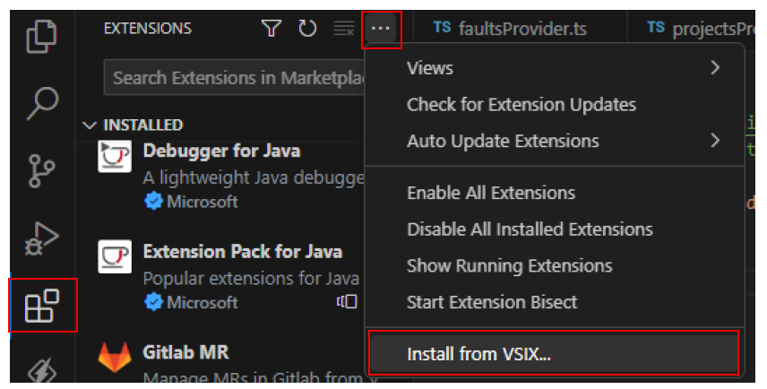

# Honeybadger inside VS Code

How to setup VS Code extension and use it to monitor errors logged in Honeybadger:

https://github.com/Afinitos/vscode-honeybadger/assets/83871614/3d93eb86-7106-474f-abb4-2382f0b7687c

# Start developing

1. `npm install`
2. `npm run compile`
3. Start debugging (`F5`) or start without debugging

# Create installation file

Instructions for creating .vsix file: 

1. Install vsce (Visual Studio Code Extensions) with: `npm install -g @vscode/vsce`
2. Create .vsix file with: `vsce package`

# Installing from VSIX file

1. Open Extensions menu
2. select "Install from VSIX..." (see attached img)

